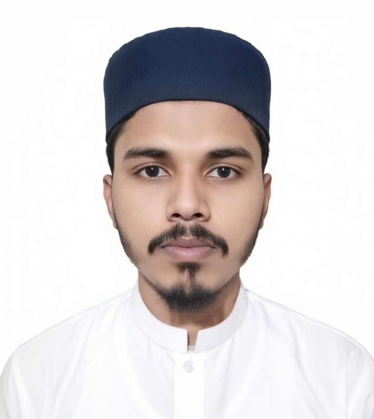

# 🚀 Muhammad Ali | Full-Stack PHP/Laravel Developer

<p align="center">
  
</p>

<h3 align="center">
Software Engineering Student • PHP/Laravel Developer • Web Application Builder
</h3>

<p align="center">
  <a href="mailto:muhammadali.dev01@gmail.com">
    
  </a>
  <a href="https://github.com/muhammadali-dev01">
    
  </a>
  <a href="https://linkedin.com/in/muhammadali-dev01">
    
  </a>
</p>

---

## 📌 About This Project

This repository contains my personal portfolio website, designed to showcase my professional experience, technical skills, certifications, and development projects.

The portfolio highlights my journey as a Software Engineering student and Full-Stack PHP/Laravel Developer, featuring responsive design, modern UI components, and project demonstrations.

---

## 👨‍💻 About Me

I am a Software Engineering student at Virtual University of Pakistan and currently working as a Full-Stack Developer Intern at UET Lahore.

My primary focus is building scalable web applications using PHP, Laravel, MySQL, JavaScript, and modern frontend technologies.

### Highlights

* 💻 Full-Stack PHP/Laravel Developer
* 🎓 BS Software Engineering Student
* 🏢 Full-Stack Developer Intern at UET Lahore
* 📚 Continuous Learner & Problem Solver
* 🚀 Open to Internship & Junior Developer Opportunities

---

## 🛠 Tech Stack

### Frontend

* HTML5
* CSS3
* Bootstrap 5
* Tailwind
* JavaScript (ES6)
* Basic React

### Backend

* PHP
* Laravel
* MVC Architecture
* REST APIs

### Database

* MySQL
* Database Design
* Query Optimization

### Tools & Platforms

* Git & GitHub
* VS Code
* XAMPP

### Additional Skills

* Python
* Selenium
* BeautifulSoup
* Pandas

---

## ✨ Portfolio Features

* Fully Responsive Design
* Modern User Interface
* Professional Resume Section
* Skills Showcase
* Project Gallery
* Contact Information
* Mobile Friendly Layout
* Smooth Navigation Experience

---

## 📂 Project Structure

```text
portfolio/
│
├── index.html
├── css/
│   └── styles.css
│
├── js/
│   └── script.js
│
├── img/
│   ├── ali2.jpg
│   ├── portfolio-preview.jpg
│   └── projects/
│
└── cv/
    └── Muhammad_Ali_Web_Resume.pdf
```

---

## 🚀 Featured Projects

### Personal Portfolio Website

Professional portfolio website developed using HTML, CSS, Bootstrap, and JavaScript with responsive design and interactive components.

### Real-Time Form Validation System

JavaScript-based validation system with instant feedback and regex-based verification.

### Noorani Qaida Learning Platform

Educational web application focused on Quranic learning and beginner-level Arabic reading.

### Calculator Application

Interactive browser-based calculator with clean UI and responsive design.

---

## 💼 Experience

### Full-Stack Developer Intern

UET Lahore

* Web application development
* CMS solutions
* Database integration
* Laravel-based development

### NAVTTC Web Development Trainee

* Full-stack web development
* Practical project implementation
* Industry-standard workflows

### Python Instructor

* Programming fundamentals
* Problem-solving concepts
* Student mentoring

---

## 🎓 Education

### BS Software Engineering

Virtual University of Pakistan

### NAVTTC Web Development Program

UET Lahore

### Intensive Software Development Program (ISDP)

UET Lahore

### Dars-e-Nizami

Jamia Ashrafia Lahore

---

## 📈 Career Objective

My goal is to become a highly skilled Software Engineer specializing in PHP/Laravel and modern web technologies while contributing to impactful software products and solving real-world problems.

---

## 📬 Contact

📧 Email: [muhammadali.dev01@gmail.com](mailto:muhammadali.dev01@gmail.com)

💼 LinkedIn:
https://linkedin.com/in/muhammadali-dev01

💻 GitHub:
https://github.com/muhammadali-dev01

📱 WhatsApp:
+92 307 4450095

---

## ⭐ Support

If you find this project useful, consider giving it a star.

It helps support my work and motivates me to continue building and sharing projects.

---

<p align="center">
  Made with ❤️ by Muhammad Ali
</p>
